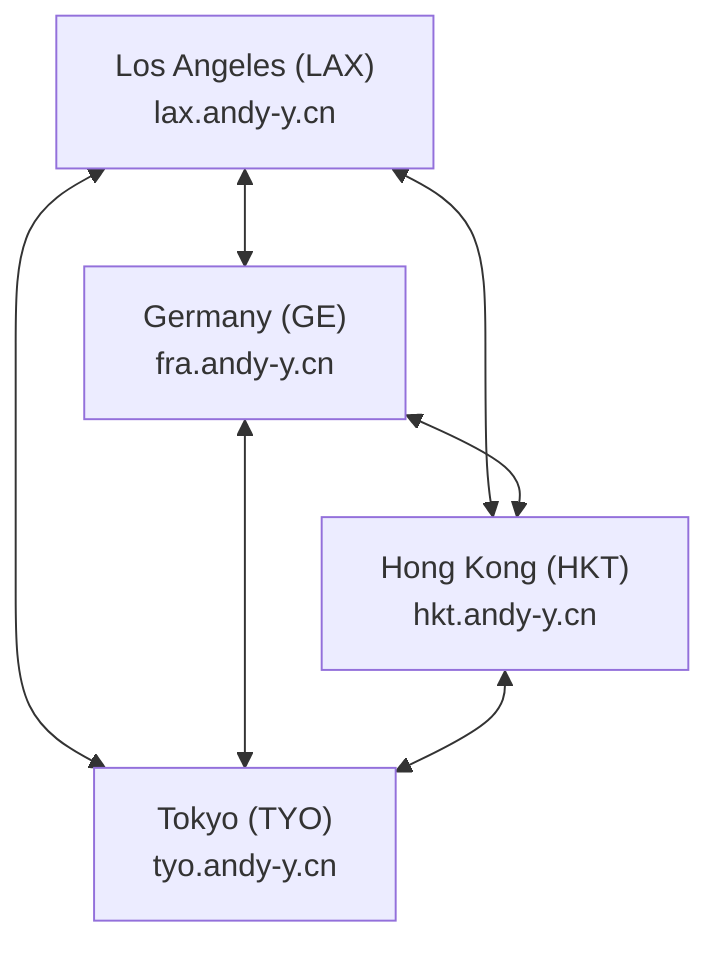

## Basic Information
- ASN: 4242422921
- Maintainer: [AndyYan](https://explorer.burble.com/?#/mntner/ANDY-MNT)
- IPv4 Block: 172.21.118.160/28
- IPv6 Block: fdd2:e3e2:c922::/48

:::alert{type="info"}
My Looking Glass: [lg.andy-y.cn](https://lg.andy-y.cn)
My Flap Alerted: [flap.andy-y.cn](https://flap.andy-y.cn)
:::

## Nodes

#### Topology

## Los Angeles, USA

- **Domain**: `lax.andy-y.cn`
- **IPv4**: `lax.andy-y.cn`
- **IPv6**: `v6.lax.andy-y.cn`
- **WireGuard Port**: `2 + last 4 digits of your ASN`
- **DN42 IPv4**: `172.21.118.165`
- **DN42 IPv6**: `fdd2:e3e2:c922::5`
- **IPv6 LLA**: `fe80::2921`
- **Public key**: `ki4mnFa0PeY7SY9OlZdS6Tw9k5Xdgq/PdYVOef2SSBc=`
- **Bandwidth**: `3000 Mbps`
- **Extended next hop**: enabled
- **MP-BGP**: enabled
- **Tunnel MTU**: `1420`

---

## Frankfurt,Germany

- **Domain**: `fra.dn42.andy-y.cn`
- **IPv4**: `fra.dn42.andy-y.cn`
- **IPv6**: `v6.fra.dn42.andy-y.cn`
- **WireGuard Port**: `2 + last 4 digits of your ASN`
- **DN42 IPv4**: `172.21.118.162`
- **DN42 IPv6**: `fdd2:e3e2:c922::2`
- **IPv6 LLA**: `fe80::2921`
- **Public key**: `wZ939wRW+xLa1VV2STTxF4oss7UxqNJCZzEUEJ5ImRM=`
- **Bandwidth**: `10 Gbps`
- **Extended next hop**: enabled
- **MP-BGP**: enabled
- **Tunnel MTU**: `1420`

---

## Hong Kong, China

- **Domain**: `hkt.andy-y.cn`
- **IPv4**: `hkt.andy-y.cn`
- **IPv6**: `None`
- **WireGuard Port**: `2 + last 4 digits of your ASN`
- **DN42 IPv4**: `172.21.118.164`
- **DN42 IPv6**: `fdd2:e3e2:c922::4`
- **IPv6 LLA**: `fe80::2921`
- **Public key**: `c7Nx4qyVnIHAzV/VUn4wdiyNFMF84Vhsblk1UyCUqD8=`
- **Bandwidth**: `30 Mbps`
- **Extended next hop**: enabled
- **MP-BGP**: enabled
- **Tunnel MTU**: `1420`

---

## Tokyo, Japan

- **Domain**: `tyo.andy-y.cn`
- **IPv4**: `tyo.andy-y.cn`
- **IPv6**: `v6.tyo.andy-y.cn`
- **WireGuard Port**: `2 + last 4 digits of your ASN`
- **DN42 IPv4**: `172.21.118.161`
- **DN42 IPv6**: `fdd2:e3e2:c922::1`
- **IPv6 LLA**: `fe80::2921`
- **Public key**: `nLyNhDOzsFUQ5LK5lrpHBlkKYkUzpzOm/p2iThlX3Dg=`
- **Bandwidth**: `3000 Mbps`
- **Extended next hop**: enabled
- **MP-BGP**: enabled
- **Tunnel MTU**: `1420`

## Features
- Multi Protocol BGP
- Extended Next Hop

## Contact
- Email:070127andy@gmail.com
