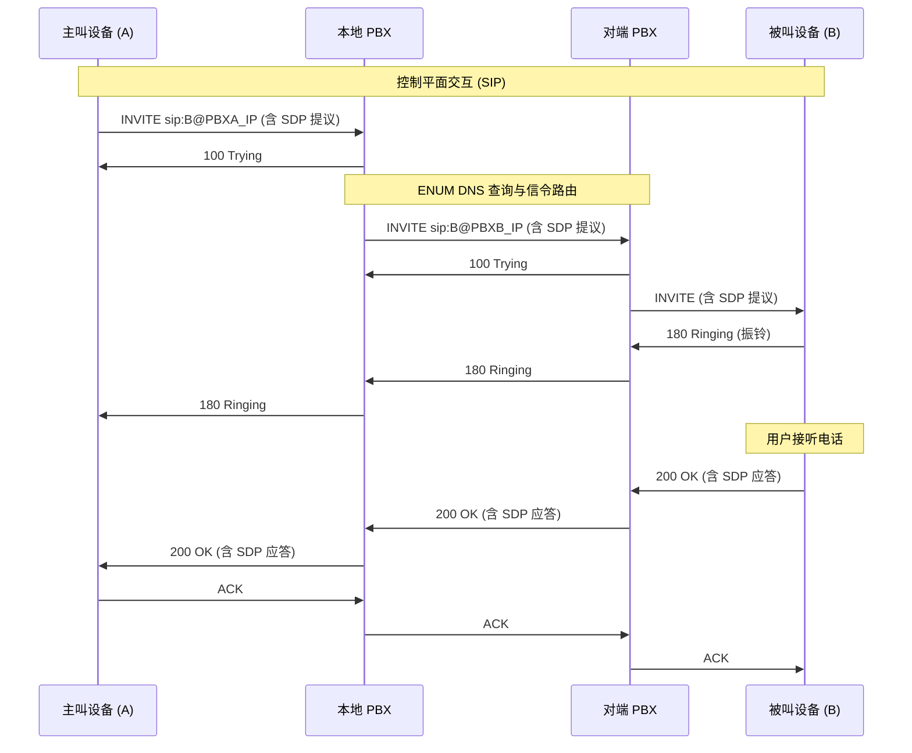
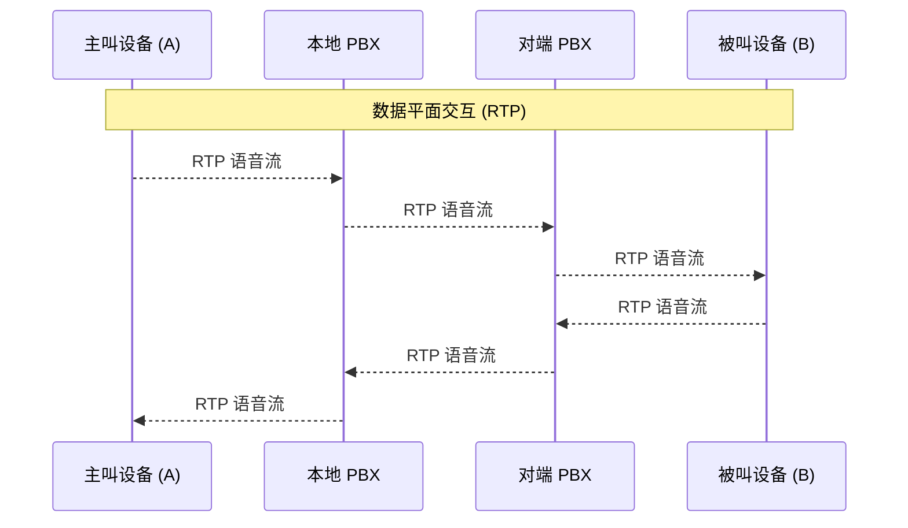

> 提示：由于本人对于电话网络的了解停留在初步阶段，本博客仅仅是我初步的学习总结，不仅十分不完善，还可能出现部分知识性错误，如遇错误与意见可联系070127andy@gmail.com，感谢您的理解和指正！


:::alert{type="info"}
另：本文默认您已经加入了DN42并至少和一位peer进行了对等连接。
:::


> 本文部分基础概念和图示基于 Yukari Chiba 的《telephony42 完全指南》整理和改写，原文采用 CC BY-SA 4.0，本文相应部分亦按 CC BY-SA 4.0 发布。
# 前言
本人在DN42网络中扮演 **AS4242422921** 并拥有一个四节点的小集群，集群间建立了 **FullMesh** 的 **IBGP** 组网，通过 **OSPF** 作为 **IGP** 协议建立内部动态路由，并申请了 **andy.dn42** 作为我的域名，搭建了 **1主+1从** 的权威服务器（由knot驱动）。
最近在DN42的群里看到了 [Yukari](https://0x7f.cc/) 大佬提到的telephony42，即一套实验性质的去中心化电话网络。我觉得自建一个电话网络很酷，于是打算跟着Yukari的 [这篇博客](https://0x7f.cc/telephony42-guide/) 搓一个 [PBX(Private Branch Exchange - 私有交换机)](https://en.wikipedia.org/wiki/Business_telephone_system) ，接入telephony42， ~~打电话骚扰群友~~ 。
# 前期准备
 - [x] 一个DN42域名
 - [x] 一台 **已接入DN42** 的，配置不低于1C1G的服务器
 - [x] 自建的DN42内部权威DNS（这里以knot演示）
# 概念须知
 *PS：本篇博客仅是“最小加入指南”，后面譬如SRTP的进阶操作本人也在学习，还请自行了解，本部分参考了0x7f的博客内容。*


| 组件 | 简要解释 |
| :--: | :--: |
| PBX (Private Branch Exchange - 私有交换机) | 视作 VoIP 网络中的路由器，负责处理信令和路由，有时也处理语音数据。 |
| B2BUA (Back-to-Back User Agent - 背靠背用户代理) | Asterisk 之类的 PBX 就是一个典型的 B2BUA。与仅转发信令的 SIP 代理不同，当 A 通过 PBX 呼叫 B 时，PBX 实际上是先以被叫的身份接听了 A 的电话，然后再以主叫的身份向 B 发起一通全新的电话，最后在内部把这两个独立的通道桥接起来。这使得 PBX 能随时介入通话过程，进行录音、转码、甚至强制掐线。 |
| Endpoint (终端设备) | 任何可以发起或接收呼叫的设备。它可以是电脑上的软件电话应用、桌面的实体 IP 电话机、ATA、网页上的 WebRTC 电话，甚至是另一个网络的 PBX。 |

---

| 协议 | 简要解释 |
| :--: | :--: |
| 会话发起协议 (SIP - RFC 3261) | 作为控制平面。采用纯文本格式，长得有点像 HTTP，包含 URI、头字段和正文。主要负责信令传输，例如传递呼叫的来源和目标、接通、挂断或拒接等，不负责传输具体的语音流。SIP 默认监听于 UDP/TCP 5060 端口（在报文较大时通常优先使用 TCP），TLS 加密状态下监听 TCP 5061 端口。 |
| 实时传输协议 (RTP - RFC 3550) | 作为数据平面。当 SIP 握手与 SDP 协商完成后，双方会在协商好的高位动态端口（通常在 UDP 10000 至 20000 之间）互相传递 RTP 数据包。这些包对延迟和抖动极其敏感。如果防火墙只放行了 SIP (5060) 但没放行 RTP，就会遇到 VoIP 史上最著名的故障： 单通（接通了但听不到声音）。 |

---

| 路由 | 简要解释 |
| :--: | :--: |
| ENUM (E.164 Number Mapping) | 是一种自动发现路由的机制。当拨打目标是未知目的地的电话时，PBX 会根据号码查询 DNS 的 NAPTR 记录，查找到该号码对应的 SIP 目标地址，在DN42通过一个特殊的DNS查询实现 |
| Context (上下文) | 是 Asterisk 拨号计划的关键组件。可以把它理解为 VoIP 系统中的 VRF。它可以把不信任的外部呼叫丢进一个没有外拨权限的隔离上下文中，并且能够通过 Goto 等语句实现在不同上下文间链式跳转，在后面的拦截伪造来电等功能上很有用 |

---

对于跨网的SIP呼叫，可以分为 **三个阶段** ：
## 第一部分：SIP 呼叫建立
PBX将充当一个类似“ **中转站** ”的角色，先接听主叫设备的 **INVITE** ，使用 **ENUM DNS**  查询（ **后面会展开解释** ）与信令路由，查询到对方的PBX之后向其转发INVITE，由对方的PBX再呼叫被叫设备，接听后层层转发回200 OK

## 第二部分：RTP 语音传输
在接通之后，通过两台PBX作为桥梁，两台终端即可在10000端口附近（可手动指定范围）互传udp数据包，即RTP语音流， *在本文关闭  `direct_media` 、由 PBX 锚定媒体的配置下* ，所有数据在逻辑上仍通过PBX转发

## 第三部分：SIP 挂断
在挂断阶段，仍是通过PBX转发BYE，回传200 OK进行挂断操作

> 通过以上内容，我们可以发现，主要的过程都离不开PBX交换机，故只要我们搭建好PBX即可初步建起自己的电话网络。而对于PBX的 **软交换平台** ，对于新手玩家Asterisk是比较好的选择。
> PS：Yukari把PBX比作 **电话网络的自治系统** ，把Asterisk比作 **电话网络的 BIRD**
# 开始部署
## 1.SIP 域名创建
在 `yourdomain.dn42`  Zone 中添加：
```yaml
sip.andy.dn42. 300 IN A     172.21.118.162  #ip对应你的PBX服务器
sip.andy.dn42. 300 IN AAAA  fdd2:e3e2:c922::2  #ip对应你的PBX服务器

pbx.andy.dn42. 300 IN CNAME sip.andy.dn42.
```
## 2.ENUM (E.164 Number Mapping)建立
由上面的内容我们可以知道，要想呼叫其他PBX下的设备，必须 **知道对方的地址** ，故我们需要一种机制将电话号码翻译成 PBX 的 IP 地址，这就是 **ENUM**
ENUM基于 **DNS** ，它很像 rDNS 的解析方式，即先将电话号码翻转，加入点号分隔，再加上一个特定的域名后缀
最后，利用 DNS 的  **NAPTR**  (Naming Authority Pointer) 记录，一个包含正则表达式的记录，就可以可以将这串倒写的号码解析成 SIP URI。
下面是demo，此正则可以匹配该前缀下的所有号码
```yaml
$ORIGIN 4.3.2.1.0.4.2.4.tel.dn42.
*  IN  NAPTR  10  100  "u"  "E2U+sip"  "!^(.*)$!sip:\\1@pbx.yourdomain.dn42!" .
```
我的权威DNS使用的是kont，下面是我创建ENUM的步骤：
#### 2.1按号码计算出自己的ENUM Zone
- 我的号码是 `+042429211001`
- 去掉 +： `042429211001`
- 逐位反转并加点： `1.0.0.1.1.2.9.2.4.2.4.0.tel.dn42.`
- 号码前缀： `+04242921`
- 对应的ENUM Zone： `1.2.9.2.4.2.4.0.tel.dn42.`
#### 2.2创建对应 ENUM Zone
创建Zone文件：
```txt
/var/lib/knot/zones/1.2.9.2.4.2.4.0.tel.dn42.zone
```
内容：
```yaml
$ORIGIN 1.2.9.2.4.2.4.0.tel.dn42.
$TTL 300

@ IN SOA ns1.andy.dn42. admin.andy.dn42. (
    2026071001
    3600
    900
    604800
    300
)

@ IN NS ns1.andy.dn42.
@ IN NS ns2.andy.dn42.

; +042429211001   #我准备创建两个分机
1.0.0.1 300 IN NAPTR 100 10 "u" "E2U+sip" \
"!^.*$!sip:1001@sip.andy.dn42!" .

; +042429211002
2.0.0.1 300 IN NAPTR 100 10 "u" "E2U+sip" \
"!^.*$!sip:1002@sip.andy.dn42!" .
```
#### 2.3使用 ` kzonecheck ` 检查 ENUM Zone 文件的合法性。
```bash
kzonecheck -o "$ZONE" "$ZONEFILE"
```
退出码  `0`  即表示PASS。
#### 2.4创建主NS对应的Knot DNS服务配置文件
示例：
```yaml
key:
  - id: telephony42-xfr
    algorithm: hmac-sha256
    secret: "[数据删除]"

remote:
  - id: telephony42-secondary
    address: 172.21.118.164
    key: telephony42-xfr

acl:
  - id: telephony42-transfer
    key: telephony42-xfr
    action: transfer

zone:
  - domain: 1.2.9.2.4.2.4.0.tel.dn42.
    file: /var/lib/knot/zones/1.2.9.2.4.2.4.0.tel.dn42.zone
    notify: telephony42-secondary
    acl: telephony42-transfer
```
在主配置中加入include：
```yaml
include: "/etc/knot/conf.d/*.conf"
```
检查合法性：
```bash
knotc conf-check
```
设置文件权限：
```bash
chown root:knot /etc/knot/conf.d
chmod 750 /etc/knot/conf.d

chown root:knot /etc/knot/conf.d/telephony42.conf
chmod 640 /etc/knot/conf.d/telephony42.conf

chown knot:knot /var/lib/knot/zones/1.2.9.2.4.2.4.0.tel.dn42.zone
chmod 640 /var/lib/knot/zones/1.2.9.2.4.2.4.0.tel.dn42.zone
```
最后重载 `kont`
#### 2.5同步到从服务器
首先生成密钥：
```bash
umask 077

openssl rand -base64 32 > /root/telephony42-xfr.secret

chmod 600 /root/telephony42-xfr.secret
chown root:root /root/telephony42-xfr.secret

stat -c '%A %U:%G %s bytes %n' /root/telephony42-xfr.secret
```
把密钥文件存放到ns2上
再到 ns2 执行：
```bash
chmod 600 /root/telephony42-xfr.secret
chown root:root /root/telephony42-xfr.secret

stat -c '%A %U:%G %s bytes %n' /root/telephony42-xfr.secret  #查看权限是否正确
```
ns2通过AXFR从ns1同步。
示例：
```yaml
key:
  - id: telephony42-key
    algorithm: hmac-sha256
    secret: "[刚刚生成的密钥]"

remote:
  - id: ns1
    address: 172.21.118.161
    key: telephony42-key

zone:
  - domain: 1.2.9.2.4.2.4.0.tel.dn42
    master: ns1
```
重载kont。
## 3.安装并配置Asterisk
我的系统是Debian13，其默认 trixie 仓库中没有完整的 Asterisk 主程序包，故打算自己编译安装。
在询问ai之后，得知：
> 教程中说可以 APT 安装，是因为它隐含使用了 Debian sid 仓库。对于已经运行 BIRD 和其他 DN42 服务的核心节点，不建议为了 Asterisk 混入 sid，可能导致基础库被大规模升级。
#### 3.1源码编译 Asterisk
安装编译依赖：
```bash
apt install -y \
  build-essential pkg-config autoconf-archive bison flex \
  wget ca-certificates patch bzip2 python3-dev \
  libedit-dev libjansson-dev libsqlite3-dev uuid-dev libxml2-dev \
  libssl-dev libcurl4-openssl-dev liburiparser-dev libxslt1-dev \
  libcap-dev libnewt-dev libncurses-dev \
  libsrtp2-dev libgsm1-dev libspeexdsp-dev \
  libogg-dev libvorbis-dev \
  bind9-dnsutils
```
下载并解压 Asterisk 22.10.1：
```bash
cd /usr/src
wget https://downloads.asterisk.org/pub/telephony/asterisk/releases/asterisk-22.10.1.tar.gz
tar -xzf asterisk-22.10.1.tar.gz
cd asterisk-22.10.1
```
配置时使用 Asterisk 自带的 pjproject：
```bash
./configure --with-pjproject-bundled
make menuselect.makeopts
```
启用所需模块：
```bash
for MODULE in \
  res_pjsip \
  chan_pjsip \
  res_pjsip_authenticator_digest \
  res_pjsip_endpoint_identifier_ip \
  res_pjsip_registrar \
  res_pjsip_session \
  res_pjsip_sdp_rtp \
  res_rtp_asterisk \
  func_enum \
  app_dial \
  app_echo \
  app_playback \
  pbx_config \
  codec_alaw \
  codec_ulaw \
  codec_g722
do
  menuselect/menuselect \
    --enable "$MODULE" \
    menuselect.makeopts
done
```
由于我的vps只有1c1g，故采用单线程编译：
```bash
make -j1
```
完成后安装：
```bash
make install
make samples
make config
make install-logrotate
ldconfig
```
#### 3.2创建Asterisk用户
官方建议Asterisk以低权限运行，故创建专用用户：
```bash
groupadd --system asterisk

useradd \
  --system \
  --gid asterisk \
  --home-dir /var/lib/asterisk \
  --shell /usr/sbin/nologin \
  asterisk
  ```
  准备目录：
  ```bash
install -d -o asterisk -g asterisk /run/asterisk
install -d -o asterisk -g asterisk /var/log/asterisk
install -d -o asterisk -g asterisk /var/spool/asterisk
install -d -o asterisk -g asterisk /var/lib/asterisk
```
最后注册系统服务并保持自启
#### 3.3配置Asterisk
- 首先是最重要的： **Asterisk只应监听DN42内部网段!防止公网 SIP 扫描和暴力注册!**
```yaml
172.21.118.162:5060/UDP
[fdd2:e3e2:c922::2]:5060/UDP
```

#### 3.4创建PJSIP 分机
我打算创建两个分机：
```yaml
1001：Windows Blink
1002：iOS SIP 客户端

1001 → +042429211001
1002 → +042429211002
```
核心配置：
```ini
[transport-dn42-ipv4]
type=transport
protocol=udp
bind=172.21.118.162:5060
local_net=172.20.0.0/14

[transport-dn42-ipv6]
type=transport
protocol=udp
bind=[fdd2:e3e2:c922::2]:5060
local_net=fd00::/8
```
分机模板：
```ini
[local-endpoint](!)
type=endpoint
context=from-local
disallow=all
allow=g722
allow=alaw
allow=ulaw
direct_media=no
rtp_symmetric=yes
force_rport=yes
rewrite_contact=yes
dtmf_mode=rfc4733
```
> 注：DNS NAPTR 定义的是外部号码如何找到本地分机；分机外呼时使用的 Telephony42 主叫号码则需要通过 endpoint 的 callerid 或拨号计划另行设置。
#### 3.5缩小RTP范围
我的内部网络目前只有两个分机，所以决定将 RTP 端口缩小到： `UDP 10000–10100`
```ini
[general]
rtpstart=10000
rtpend=10100
strictrtp=yes
```
#### 3.6拨号计划
我的内部号码：
 `1001    1002`
我打算使用一个号码进行本地ECHO测试：
 `5000`
我的核心拨号计划：
```bash
[from-local]
exten => _XXXX,1,NoOp(Local call)
 same => n,Goto(local-extensions,${EXTEN},1)

[local-extensions]
exten => 1001,1,Dial(PJSIP/1001,30)
 same => n,Hangup()

exten => 1002,1,Dial(PJSIP/1002,30)
 same => n,Hangup()

exten => 5000,1,Answer()
 same => n,Wait(1)
 same => n,Echo()
 same => n,Hangup()
 ```
最后验证模块是否正常：
```bash
asterisk -rx 'module show like chan_pjsip'
asterisk -rx 'module show like res_pjsip'
asterisk -rx 'module show like res_rtp_asterisk'
asterisk -rx 'module show like func_enum'
asterisk -rx 'core show application Echo'
asterisk -rx 'core show function ENUMLOOKUP'
```
重载Asterisk：
```bash
asterisk -rx "pjsip reload"
```
#### 3.7在PBX上部署分流 DNS
由于PBX的默认DNS并不能解析tel.dn42，故应该部署dnsmasq对以下域名进行分流：
```txt
<yourdomain>.dn42
tel.dn42
```
安装dnsmasq：
```bash
apt install -y dnsmasq
```
我的配置文件示例：
 `/etc/dnsmasq.d/dn42.conf`
```ini
server=/andy.dn42/172.21.118.161
server=/andy.dn42/172.21.118.164

server=/tel.dn42/172.21.118.161
server=/tel.dn42/172.21.118.164
#注：Knot DNS 只实现权威 DNS 服务，不是递归解析器，上面两行请设置成自己的权威DNS！
listen-address=127.0.0.1
bind-interfaces
```
重启dnsmasq（由于 **监听地址** 变化，无法进行热重载）:
```bash
systemctl restart dnsmasq
```
在Asterisk 中测试：
```bash
asterisk -rx \
  'dialplan eval function ENUMLOOKUP(+042429211001,sip,u,1,tel.dn42)'
```
如果正常，应该返回：
```bash
sip:1001@sip.andy.dn42
```
#### 3.8配置 Telephony42 外呼拨号计划
由于ENUM只负责告诉Asterisk“打给谁”，但后续Asterisk需要决定用哪个PJSIP endpoint 发起呼叫等等，故我们需要一个通用出站模板`peer-enum-outbound`
于是在 `pjsip.conf` 中配置一个无需注册的出站 endpoint。
示例：
```ini
[peer-enum-outbound]
type=endpoint
transport=transport-udp
context=from-enum
disallow=all
allow=ulaw
allow=alaw
aors=peer-enum-outbound
direct_media=no

[peer-enum-outbound]
type=aor
```
实际目标由 ENUM 返回的 SIP URI 决定
#### 3.9配置 Telephony42 外呼拨号计划
在  `extensions.conf`  中添加：
```ini
[internal]
exten => _+X.,1,NoOp(Telephony42 outbound: ${EXTEN})
 same => n,Set(ENUMURI=${ENUMLOOKUP(${EXTEN},sip,u,1,tel.dn42)})
 same => n,Set(ENUMURI=${ENUMLOOKUP(${ENUMNUM},sip,,1,tel.dn42)})
 same => n,NoOp(ENUM result: ${ENUMURI})
 same => n,GotoIf($["${ENUMURI}"=""]?enum-failed)
 same => n,Dial(PJSIP/${ENUMURI}@peer-enum-outbound,60)
 same => n,Hangup()

 same => n(enum-failed),Playback(invalid)
 same => n,Hangup()
 ```
 重载Asterisk:
 ```bash
asterisk -rx "pjsip reload"
asterisk -rx "dialplan reload"
```
 此时通过 `1001` 拨打 `+042429211002`应该已经能通了。
  **推荐使用 `sngrep` 进行通话流程分析，其是一个专用于 SIP 的 TUI 抓包与可视化工具（附有颜色标识）。**
#### 3.10配置 Telephony42 入站 SIP
为了接收其他 Telephony42 节点的呼叫，需要设置入站 endpoint。
示例：
```ini
[peer-enum-inbound]
type=endpoint
transport=transport-udp
context=context-enum
disallow=all
allow=ulaw
allow=alaw
direct_media=no
```
然后添加identify，让来自DN42的SIP包匹配到该endpoint。
```ini
[peer-enum-inbound-identify-v4]
type=identify
endpoint=peer-enum-inbound
match=10.0.0.0/8
match=172.20.0.0/14
match=172.31.0.0/16

[peer-enum-inbound-identify-v6]
type=identify
endpoint=peer-enum-inbound
match=fd00::/8
```
再次强调： **千万不要把公网 0.0.0.0/0 放进去！！**
#### 3.11配置独立入站 Context
在入站时，通话会先被引入到一个独立的Context中。
```ini
[context-enum]
exten => 1001,1,NoOp(Telephony42 inbound to 1001)
 same => n,Dial(PJSIP/1001,30)
 same => n,Hangup()

exten => 1002,1,NoOp(Telephony42 inbound to 1002)
 same => n,Dial(PJSIP/1002,30)
 same => n,Hangup()
 ```
 重新加载Asterisk
 ** 需要注意，独立的入站 Context 只能限制外部来电的拨号权限，不能证明 CallerID 真实有效。**
## 4.提交 Telephony42 Registry
```ini
telephony:          +04242921
nserver:            ns1.andy.dn42
nserver:            ns2.andy.dn42
admin-c:            ANDY-DN42
tech-c:             ANDY-DN42
mnt-by:             ANDY-MNT
source:             DN42
```
## 5.PR合并后验证
父区委派生效后，你可以使用 DN42 递归 DNS 查询。
```bash
ZONE="1.2.9.2.4.2.4.0.tel.dn42."
#检查 NS：
dig @172.20.0.53 "$ZONE" NS \
  +noall +answer +authority
#正常应显示：
#ns1.andy.dn42.
#ns2.andy.dn42.
```
至此，大公告成！快访问yp.dn42拨打 ~~奇奇怪怪~~ 的电话吧！
# 参考文章：
-  [telephony42 完全指南：从零开始在 dn42 构建电话网络](https://0x7f.cc/telephony42-guide/)
-  [在 Telephony42 中配置 E.164 ENUM](https://0x7f.cc/e164-dn42/)

