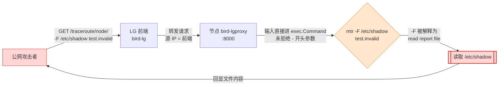
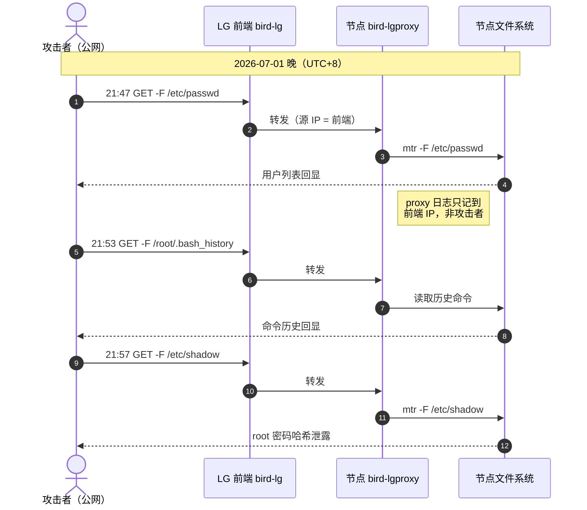
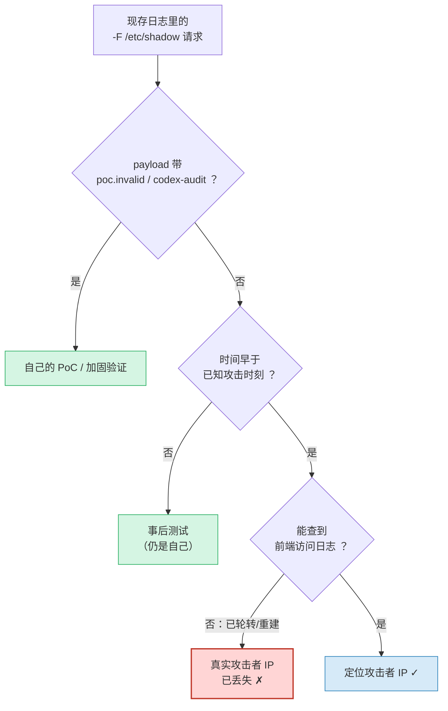

> 本文隐去了真实主机名、域名与 IP，但保留了完整的攻击 payload 与处置命令，方便复现与自查。

## TL;DR

我的 DN42 集群跑着一个公网可访问的 [bird-lg-go](https://github.com/xddxdd/bird-lg-go) Looking Glass，四台节点共用一个前端。其中 `bird-lgproxy` **≤ v1.4.6** 存在参数注入漏洞（**CVE-2026-26514**，GHSA-3qm5-22pm-wqg9）：攻击者通过 traceroute 功能的 `q` 参数注入 mtr 的 `-F` 选项，把任意文件当作“报告文件”读出来，最终读到了每台机器的 `/etc/shadow`——也就是 root 密码哈希。注意 **v1.4.6 的修复不完整、可被绕过**，真正修好是在 **v1.4.7**。

处置结论：**四台节点全部升级到 v1.4.7、轮换全部 root 密码、审计 SSH 密钥与计划任务、确认无后门与异常登录。** 漏洞在公网边缘已验证彻底关闭。

## 漏洞原理

Looking Glass 的 traceroute 功能，本质上是把用户输入的目标丢给系统的 `mtr` / `traceroute` 去跑。问题出在旧版 `bird-lgproxy` 直接把用户输入拼进 `exec.Command`，**既没有把它当成单一目标、也没有拒绝以 `-` 开头的输入**。于是用户输入里可以夹带选项。攻击者只要构造：

```
-F /etc/shadow test.invalid
```

它就被当成了 `mtr -F /etc/shadow test.invalid`。而 mtr 的 `-F` 选项恰好是“从文件读取主机列表（report file）”——mtr 会尝试打开 `/etc/shadow`，并在报错信息里带出文件内容；而 proxy 用 `CombinedOutput()` 把 stdout + stderr 一起回显给前端，于是文件内容就顺着错误输出泄露了出去。`test.invalid` 只是凑一个“看起来像目标”的占位。

于是一条 HTTP GET 就能读任意文件：

```bash
# 攻击者视角：通过公网 LG 前端读取 /etc/shadow
curl 'https://<lg-frontend>/traceroute/<node>/-F%20%2Fetc%2Fshadow%20test.invalid'
```

这类问题的根源是老生常谈的一句话：**永远不要把用户输入拆成命令行参数**。目标就该当作一个不可拆分的整体字符串，任何以 `-` 开头的东西都不该被解释成选项。

下面这张图把整条注入链路画出来了——注意红色路径是漏洞如何从一个 HTTP 参数一路变成任意文件读取的：



## 攻击时间线

从被攻击节点的 `bird-lgproxy` 日志里，能看到一段非常“教科书”的探测→提权信息收集过程（时间为东八区，2026 年 7 月 1 日晚）：

| 时间（UTC+8） | 谁 | 干了什么 |
|---|---|---|
| 07-01 21:47 | 攻击者（经前端转发） | `bird-lgproxy` 读 `/etc/passwd`（枚举用户、确认可读文件） |
| 07-01 21:53 | 攻击者 | 读 `/root/.bash_history`（翻历史命令，找线索/凭据） |
| 07-01 21:57 | 攻击者 | 读 `/etc/shadow`（拿到 root 密码哈希） |

用时序图看这十分钟的动作更直观，也能看清“攻击者 → 前端 → proxy → 文件系统”这条链路上，日志分别记在了哪一层：




日志里的 payload 长这样（URL 编码前）：

```
GET /traceroute?q=-F+/etc/passwd+<占位主机>
GET /traceroute?q=-F+/etc/shadow+<占位主机>
```

从 `passwd` → `bash_history` → `shadow` 的顺序很典型：先确认漏洞可用、再翻可能藏凭据的地方、最后直取密码哈希准备离线爆破。整个过程只花了十分钟。

## 取证的一个坑：日志里的“攻击者 IP”是我自己的前端机

这里有个值得单独拎出来讲的教训。

bird-lg 是**前端 + 后端 proxy 分离**的架构：公网用户访问前端，前端再把 traceroute 请求转发给各节点的 `bird-lgproxy`。所以当我去被攻击节点的 proxy 日志里查“攻击者 IP”时，看到的源地址**全是前端机器自己的 IP**——因为对 proxy 来说，请求确实是前端发来的。

真正的攻击者公网 IP，只存在于**前端（反向代理 / 前端容器）的访问日志**里。而等我开始做取证时：

- proxy 容器在升级时被重建，日志只剩当天；
- 前端所在机器的反代访问日志已经轮转，最早的记录已经晚于攻击发生的时间；
- 各节点 journald 的留存窗口也已经滚过了原始攻击时刻。

结果就是：**现存日志里所有 `-F /etc/shadow` 的请求，溯源后都指向我自己后来做的 PoC 验证和加固测试**（payload 里还带着我自己打的 `poc.invalid`、`codex-audit` 之类的标记）。原始攻击者的真实 IP，随日志轮转丢失了。

溯源时对每一条 `-F /etc/shadow` 请求的判定逻辑大致是这样，最后能落到“真实攻击者 IP”的路径全被日志留存挡死了：




也做了兜底核查——确认没有异常后果：

- **登录审计**：所有成功的 root 登录源 IP 要么是我自己的出口，要么是我常用宽带 IP 段（带密钥登录用的是我自己的部署密钥），没有陌生境外 IP 成功登录，无横向移动迹象。
- **authorized_keys**：逐个核对指纹，只有我自己的密钥，无陌生 key。
- **计划任务 / 进程**：无后门 cron，无可疑常驻进程。

教训很直接：**面向公网的服务，一定要把访问日志的留存时间调长、并集中收走**。等出事了再回头翻，日志往往已经不在了——尤其是这种“真实来源只记录在前端一层”的架构，取证窗口比你想的更短。

## 漏洞报告与致谢

发现异常后，我第一时间意识到这是个真实的安全问题，但我本身对安全研究并不在行。于是我把情况同步给了朋友 **[@KaguraiYoRoy](https://github.com/KaguraiYoRoy)**，最终由他完成了漏洞分析、复现与规范的安全报告，一起负责任地披露给了上游作者。上游据此发布了官方安全公告并修复：

> **GHSA-3qm5-22pm-wqg9** — Argument Injection / Exposure of Sensitive Information
> CVE-2026-26514 · CWE-88（Argument Injection）+ CWE-200（Sensitive Info Exposure）
> CVSS 3.1: **7.5 High**（`AV:N/AC:L/PR:N/UI:N/S:U/C:H/I:N/A:N`）
> 影响版本：`bird-lgproxy` ≤ 1.4.6 · 修复版本：1.4.7 · 发布：2026-07-02
> 致谢：**KaguraiYoRoy**（Analyst）、**AndyYJF**（Reporter）
>
> 公告原文：<https://github.com/xddxdd/bird-lg-go/security/advisories/GHSA-3qm5-22pm-wqg9>

借这次事，也想说一句：**不懂安全不丢人，但发现问题别憋着**。找个懂行的朋友一起走负责任披露的流程，比自己瞎折腾或者装作没看见都强得多。

## 修复：升级到 v1.4.7

需要强调的是：**v1.4.6 的第一次修复并不彻底**——它可以被无空格变体绕过，比如 `-F/etc/shadow`（选项和路径连在一起，绕过了当时基于空格的判断）。真正修好是在 **v1.4.7**：它对 traceroute 目标增加了 `strings.HasPrefix(query, "-")` 检查，**任何以 `-` 开头的输入直接拒绝**，从根上断掉了“把输入当选项”的可能。这样 `-F /etc/shadow` 会被直接拦下返回 `Invalid target.`，CVE 到这里彻底堵死。

我把四台节点全部拉到了 v1.4.7。集群里有两种部署方式，处理方式不同：

**systemd 直接跑二进制的节点**——换二进制 + 重启：

```bash
cd /tmp
curl -sLO https://github.com/xddxdd/bird-lg-go/releases/download/v1.4.7/bird-lgproxy-go-v1.4.7-linux-amd64.tar.gz
tar xzf bird-lgproxy-go-v1.4.7-linux-amd64.tar.gz
cp -a /usr/local/bin/bird-lgproxy-go /usr/local/bin/bird-lgproxy-go.pre-v1.4.7.bak  # 留回滚点
cp -f bird-lgproxy-go /usr/local/bin/bird-lgproxy-go
chmod +x /usr/local/bin/bird-lgproxy-go
systemctl restart bird-lgproxy
```

**Docker 部署的节点**——用 `FROM scratch` 的本地镜像，替换其中的 proxy 二进制后重建：

```bash
# 构建上下文里就一个 Dockerfile + proxy 二进制 + 自带的 traceroute
# Dockerfile:
#   FROM scratch
#   COPY proxy /proxy
#   COPY traceroute /traceroute
#   ENTRYPOINT ["/proxy"]
cp -f proxy.v147 ./bird-lgproxy-v1.4.7/proxy
docker compose up -d --build bird-lgproxy
```

## 验证：用攻击者的原始 payload 打自己

修复不能只看版本号，得用**攻击者的真实路径**去验证。我把原始 payload 通过公网前端重放到每一台节点：

```bash
for node in <node1> <node2> <node3> <node4>; do
  curl -s "https://<lg-frontend>/traceroute/$node/-F%20%2Fetc%2Fshadow%20test.invalid" \
    | grep -c 'root:'   # 期望：0
done
```

四台全部返回 `Invalid target.`，`/etc/shadow` 内容零泄露。直接对本地 `:8000` 打也是同样结果：

```bash
curl -s 'http://127.0.0.1:8000/traceroute?q=-F+/etc/shadow+8.8.8.8'
# 旧版：吐出 /etc/shadow 内容
# v1.4.7：HTTP 400 / Invalid target.
```

## 收尾清单

- [x] 四台节点升级到 v1.4.7，保留回滚二进制/compose
- [x] 用原始 payload 经公网前端重放验证，四台 `/etc/shadow` 零泄露
- [x] 轮换全部 root 密码（≥16 位混合）
- [x] 审计 `authorized_keys` 指纹、cron、常驻进程——无异常
- [x] 核查登录历史——无陌生 IP 成功登录

## 几点反思

1. **别把用户输入拆成命令行参数。** 这不是 LG 独有的坑，任何把外部输入拼进 `exec` 的地方都要警惕以 `-` 开头的注入。目标当整体字符串处理是底线。
2. **公网服务的 proxy 别裸奔在 `0.0.0.0`。** 我这次四台的 `bird-lgproxy :8000` 都是公网直接可达的——下一步准备把它收敛到只允许前端访问（iptables / 只监听内网）。少一个公网入口，就少一层攻击面。
3. **日志留存要提前配好、集中收走。** 出事后才发现真正的攻击者 IP 只记录在前端一层、而且已经轮转丢了。取证的黄金窗口比想象中短得多。

---

*本文用于记录与分享，已隐去全部真实主机名、域名与 IP。如果你也在跑公网 Looking Glass，建议立刻确认 `bird-lgproxy` 版本 ≥ v1.4.7。*

