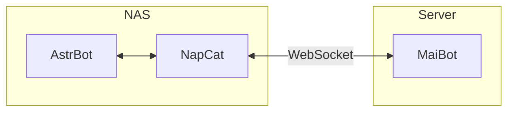

# 灵感来源#
最近一直在捣鼓QQ机器人，目前后端比较有名的就是[AstrBot](https://astrbot.app/)和 [MaiBot](https://docs.mai-mai.org/) 项目，其中AstrBot注重功能性（有多样化的插件服务）而MaiBot注重LLMs聊天与拟人化，遂想要同时给我的机器人接入两个项目，而由于TX的风控，部署在云服务器上的NapCat容易被下号，而由于网络环境问题，MaiBot最好运行在海外服务器上（可以方便的访问Gemini等AI的api），故想到了将AstrBot与NapCat部署在家里NAS上，MaiBot部署在公网服务器上的思路，拓扑图如下：



:::alert{type="info"}
这里将NapCat和AstrBot部署在同一个服务器上，这是因为AstrBot在执行一些功能的时候需要和NapCat共用文件夹，若分开部署则会出现很多问题
:::


# 部署#
## 前期准备##
 - [x] 一台公网服务器（最好2c2g及以上配置）
 - [x] 一台家宽网络下的Linux服务器
 - [x] docker环境
## 开始部署##
- 首先进入家里云ssh
```bash
mkdir astrbot
cd astrbot
wget https://raw.githubusercontent.com/NapNeko/NapCat-Docker/main/compose/astrbot.yml
sudo docker compose -f astrbot.yml up -d
```
完成
- 然后进入公网服务器


:::alert{type="info"}
该部分以下内容大多直接来自官方文档
:::

## 一、准备麦麦部署环境

### 1.1 创建项目目录

```bash
mkdir -p maim-bot/docker-config/{mmc,adapters} && cd maim-bot
```

### 1.2 获取 Docker 编排文件

```bash
wget https://raw.githubusercontent.com/Mai-with-u/MaiBot/main/docker-compose.yml
```

> 备用下载方式  
> 若 GitHub 直连不稳定，可使用镜像源：
>
> ```bash
> wget https://fastly.jsdelivr.net/gh/Mai-with-u/MaiBot@main/docker-compose.yml
> ```

### 1.3删除其中的NapCat容器并取消注释`adapter`的端口映射
使用`vim docker-compose.yml`编辑，编辑完成后如下:
```toml
services:
  adapters:
    container_name: maim-bot-adapters
    #### prod ####
    image: unclas/maimbot-adapter:latest
    # image: infinitycat/maimbot-adapter:latest
    #### dev ####
    # image: unclas/maimbot-adapter:dev
    # image: infinitycat/maimbot-adapter:dev
    environment:
      - TZ=Asia/Shanghai
    ports: #<--此处修改
      - "8095:8095" #<--此处修改
    volumes:
      - ./docker-config/adapters/config.toml:/adapters/config.toml # 持久化adapters配置文件
      - ./data/adapters:/adapters/data # adapters 数据持久化
    restart: always
    networks:
      - maim_bot
  core:
    container_name: maim-bot-core
    #### prod ####
    image: sengokucola/maibot:dev
    # image: infinitycat/maibot:latest
    #### dev ####
    # image: sengokucola/maibot:dev
    # image: infinitycat/maibot:dev
    environment:
      - TZ=Asia/Shanghai
      - EULA_AGREE=99f08e0cab0190de853cb6af7d64d4de # 同意EULA
      - PRIVACY_AGREE=9943b855e72199d0f5016ea39052f1b6 # 同意EULA
#    ports:
#      - "8000:8000"
    volumes:
      - ./docker-config/mmc/.env:/MaiMBot/.env # 持久化env配置文件
      - ./docker-config/mmc:/MaiMBot/config # 持久化bot配置文件
      - ./data/MaiMBot/maibot_statistics.html:/MaiMBot/maibot_statistics.html #统计数据输出
      - ./data/MaiMBot:/MaiMBot/data # 共享目录
      - ./data/MaiMBot/plugins:/MaiMBot/plugins # 插件目录
      - ./data/MaiMBot/logs:/MaiMBot/logs # 日志目录
      - site-packages:/usr/local/lib/python3.13/site-packages # 持久化Python包
    restart: always
    networks:
      - maim_bot
  sqlite-web:
    # 注意：coleifer/sqlite-web 镜像不支持arm64
    image: coleifer/sqlite-web
    container_name: sqlite-web
    restart: always
    ports:
      - "8120:8080"
    volumes:
      - ./data/MaiMBot:/data/MaiMBot
    environment:
      - SQLITE_DATABASE=MaiMBot/MaiBot.db  # 你的数据库文件
    networks:
      - maim_bot

  # chat2db占用相对较高但是功能强大
  # 内存占用约600m，内存充足推荐选此
  # chat2db:
  #   image: chat2db/chat2db:latest
  #   container_name: maim-bot-chat2db
  #   restart: always
  #   ports:
  #     - "10824:10824"
  #   volumes:
  #     - ./data/MaiMBot:/data/MaiMBot
  #   networks:
  #     - maim_bot

volumes:
  site-packages:
networks:
  maim_bot:
    driver: bridge

```
## 二、麦麦环境配置

### 2.1 准备配置文件模板

```bash
# 获取核心组件配置模板
wget https://raw.githubusercontent.com/MaiM-with-u/MaiBot/main/template/template.env      -O docker-config/mmc/.env
# 若 GitHub 直连不稳定，可使用镜像源：https://fastly.jsdelivr.net/gh/Mai-with-u/MaiBot@main/template/template.env
```

获取 `adapter` 的 `config.toml`:

```bash
wget https://github.com/MaiM-with-u/MaiBot-Napcat-Adapter/raw/refs/heads/main/template/template_config.toml      -O docker-config/adapters/config.toml
# 若 GitHub 直连不稳定，可使用镜像源：https://fastly.jsdelivr.net/gh/Mai-with-u/MaiBot-Napcat-Adapter@main/template/template_config.toml
```

> 配置文件里的服务名如不可用可替换为容器名  
> * `MaiBot_Server` 配置可替换成 `maim-bot-core`  
> * `napcat` ws 客户端可替换成 `ws://maim-bot-adapters:8095`

### 2.2 预留文件

这个文件是 MaiBot 运行统计报告。

`MacOS/Linux`:

```bash
mkdir -p data/MaiMBot && touch ./data/MaiMBot/maibot_statistics.html
```

`Windows`:

```bash
mkdir data\MaiMBot && type nul > .\data\MaiMBot\maibot_statistics.html
```

### 2.3 修改相关配置

```bash
vim docker-config/mmc/.env
```

需修改以下关键参数:

```ini
# 网络监听配置
HOST=0.0.0.0
```

修改适配器配置文件:

```bash
vim docker-config/adapters/config.toml
```

```toml
[napcat_server] # Napcat连接的ws服务设置
host = "0.0.0.0"
port = 8095
heartbeat_interval = 30
tocken = '123123123' #这里必须要设置，为了NAS和公网服务器建立websocket连接时鉴权

[maibot_server] # 连接麦麦的ws服务设置
host = "core"
port = 8000
```

### 2.3 取消注释 docker-compose.yml 的 EULA

```bash
vim docker-compose.yml
# 取消注释以下两行（30-31 行）
- EULA_AGREE=bda99dca873f5d8044e9987eac417e01  # 同意 EULA
- PRIVACY_AGREE=42dddb3cbe2b784b45a2781407b298a1 # 同意 Privacy
```

### 2.4 数据库管理工具

```yaml
#sqlite-web:
#  # 注意：coleifer/sqlite-web 镜像不支持 arm64
#  image: coleifer/sqlite-web
#  container_name: sqlite-web
#  restart: always
#  ports:
#    - "8120:8080"
#  volumes:
#    - ./data/MaiMBot:/data/MaiMBot
#  environment:
#    - SQLITE_DATABASE=MaiMBot/MaiBot.db
#  networks:
#    - maim_bot

# chat2db 占用相对较高但是功能强大
# 内存占用约 600m，内存充足推荐选此
chat2db:
  image: chat2db/chat2db:latest
  container_name: maim-bot-chat2db
  restart: always
  ports:
    - "10824:10824"
  volumes:
    - ./data/MaiMBot:/data/MaiMBot
  networks:
    - maim_bot
```

### 2.5 目录结构

```
.
├── docker-compose.yml
├── data
│   └── MaiMBot
│       └── maibot_statistics.html
└── docker-config
    ├── adapters
    │   └── config.toml
    └── mmc
        └── .env
```

---

## 三、初始化容器环境

### 3.1 首次启动容器生成剩余配置文件

```bash
docker compose up -d && sleep 15 && docker compose down
```

### 3.2 调整麦麦配置

```bash
vim docker-config/mmc/bot_config.toml
vim docker-config/mmc/model_config.toml
```

---

## 四、启动麦麦

### 4.1 启动所有组件

```bash
docker compose up -d
```

### 4.2 验证服务状态

```bash
docker compose ps
```

---

## 配置NapCat
Napcat 配置入口: http://公网服务器IP:6099  
- 网络配置使用websocket客户端，url为ws://<你的公网服务器ip>:8095 tocken和你之前在adapter中的tocken一致，启用：
 
大功告成！

---
# 参考文档：

1. [使用 Docker 部署 AstrBot](https://docs.astrbot.app/deploy/astrbot/docker.html)

2. [使用 Docker 部署 MaiBot](https://docs.mai-mai.org/manual/deployment/mmc_deploy_docker.html)


